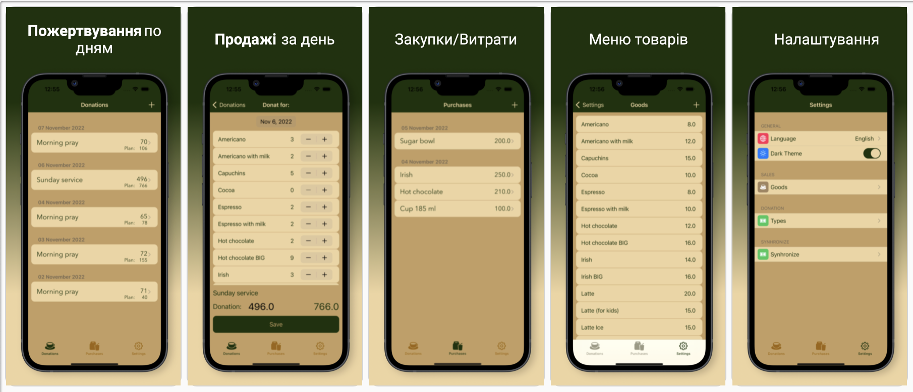

# Donat Cafe

Додаток для обліку доходів та витрат в кафе, що працює за принципом пожертвувань (за донати).

> Донат — це добровільний подарунок або пожертвування (у вигляді грошей, речей, послуг або ідей) для певної мети.


---

## Зміст

- [Опис](#опис)
- [Як використовувати](#як-використовувати)
- [Посилання](#посилання)
- [Про автора](#про-автора)

---

### Опис
Killer-features - унікальність пропозиції, простота використання, синхронізація декількох пристороїв 
#### Можливості

- облік витрат на закупівлю матеріалів (кава, цукор, стаканчики і т.п.)
- облік витрат на закупівлю послуг (оренда, електроенегрія, сплата податків, техічне обслуговування і т.п)
- облік надходжень коштів в розрізі видів надходжень (види надходжень задаються самостійно)
- облік резульатів діяльності (доходи - витрати)
- облік продаж (виявлення ходових товарів, меню та планові ціни задаються самостійно)
- планування продаж, план-фактний аналіз
- підтримка світлої та темної тем
- пдтримка локалізації
- звіт по результатм діяльності (графіки, діаграми)
- синхронізація декількох пристроїв (хмарна база даних)

#### Технології

- MVVM
- зберігання данних: Realm
- бекенд: Firebase-Firestore
- AutoLayout
- верстка кодом

[Наверх](#donat-cafe)

---

## Як використовувати

#### Installation


#### API Reference

```html
    <p>Згодом тут буде інструкція по встановленню проекту</p>
```
[Наверх](#donat-cafe)

---

## Посилання
[Чому донат — це майбутнє, якщо все зробити правильно](https://habr.com/ru/post/528610/)
[Створення скріншотів](https://appscreens.com/user/screen/bnYpWfX2zK3fh5mGiTLm)
[Наверх](#donat-cafe)

---

## Про автора

- LinkedIn - [Leonid Kvit](https://www.linkedin.com/in/leokvit/)

[Наверх](#donat-cafe)
